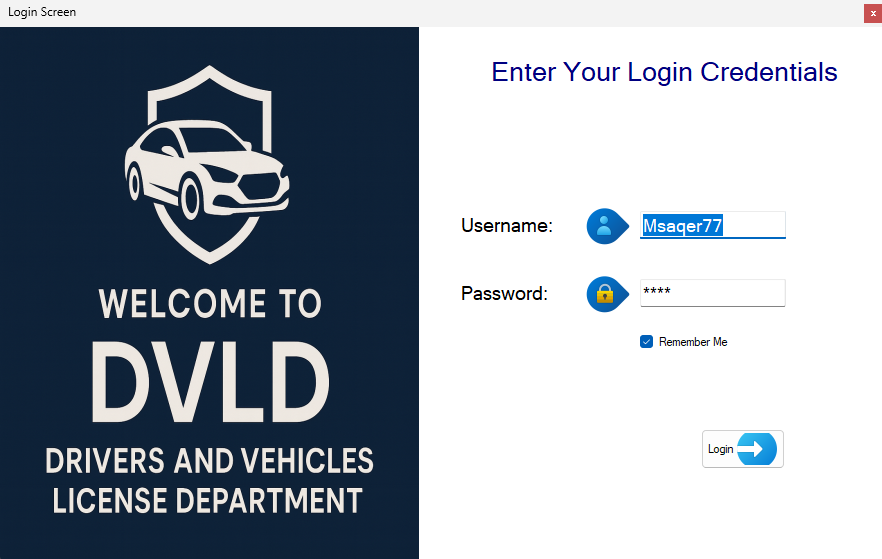
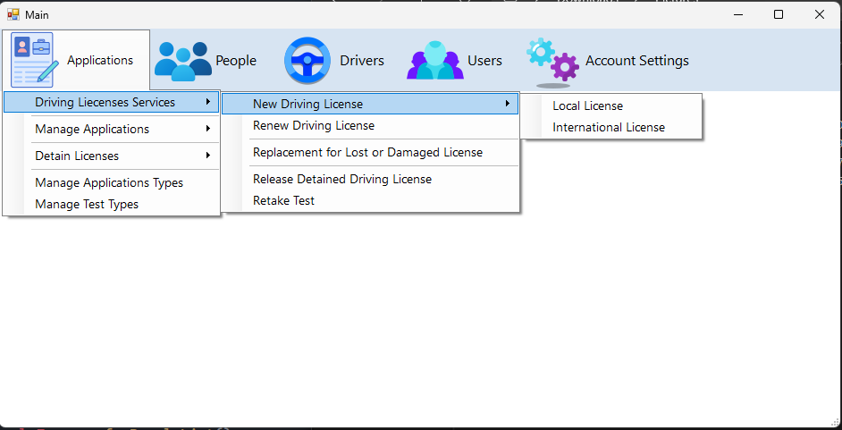
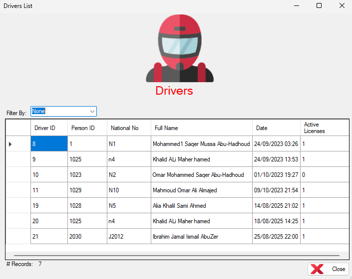
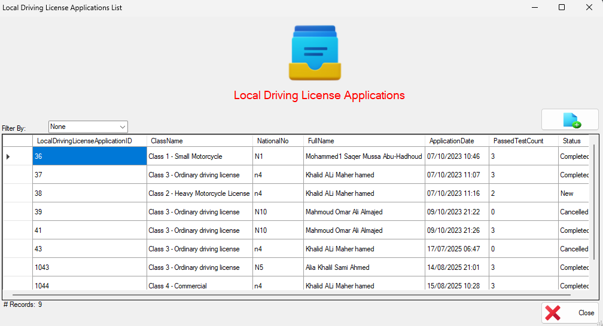
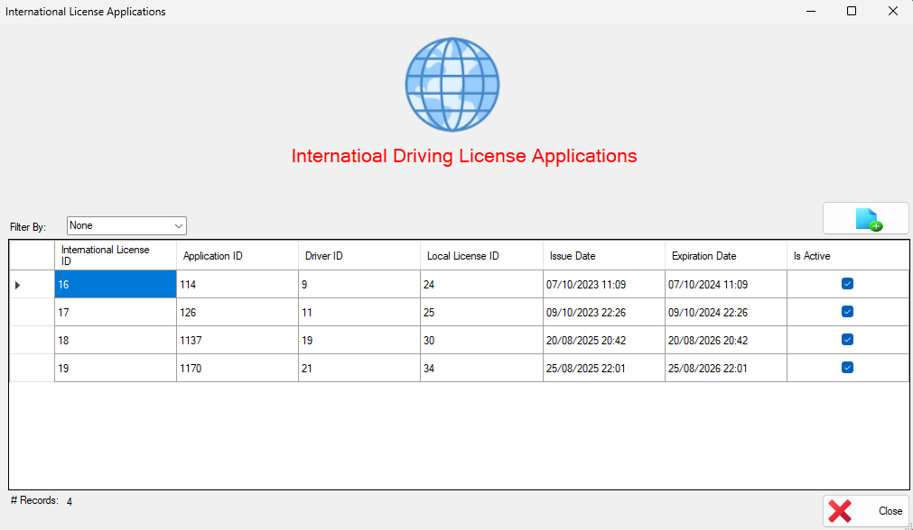

# DVLD — Driver & Vehicle Licensing (WinForms + SQL Server)

[](#)
[](#)
[](#)

A desktop app for managing people, users, drivers, licenses, tests, and applications in a DVLD-like domain.
Built for learning and demo purposes: run locally, explore the domain, and review the data access patterns.

---

## Overview
Core workflows:
- Manage people and users
- Local/international license applications
- Issue, renew, and re-issue licenses
- Test appointments and results
- Detained license handling

The code uses an **Active Record** style business layer on top of a static **ADO.NET** data access layer.

---

## Screenshots

> Put these images in `docs/screenshots/` in your repo (filenames **without spaces**):  
> `LoginScreen.png`, `MainScreen.png`, `DriversList.png`, `LocalDrivingLicenseApplications.png`, `InternationalLicenseApplications.png`

| Login | Main Screen | Drivers List |
|---|---|---|
|  |  |  |

| Local Driving License Applications | International License Applications |
|---|---|
|  |  |

---

## Tech Stack
- **UI:** Windows Forms (.NET Framework **4.8.1**)
- **Language:** C#
- **Database:** SQL Server (LocalDB/Express/Developer)
- **Data Access:** ADO.NET (`SqlConnection`, `SqlCommand`, `SqlDataReader`)

## Tested On
Windows 11 · Visual Studio 2022 (17.x) · SQL Server 2019/2022

## Solution Layout
```
DVLD-DriverAndVehiclesLicenseDepartment/   # WinForms UI project
├─ App.config
├─ Global Classes/
│  └─ clsGlobal.cs
├─ Forms/ ...
├─ DVLD-DataAccessLayer/
│  ├─ DataAccessSettings.cs
│  └─ *Data.cs
└─ DVLD-BusinessLayer/
   └─ cls*.cs
```

## Getting Started
```bash
git clone https://github.com/IbrahimAlShakak/DVLD-DriverAndVehiclesLicenseDepartment
cd DVLD-DriverAndVehiclesLicenseDepartment
```

1) Create a SQL Server database named `DVLD`  
2) Configure the connection string in `App.config`:
```xml
<configuration>
  <connectionStrings>
    <add name="DVLD"
         connectionString="Data Source=.;Initial Catalog=DVLD;Integrated Security=True" />
  </connectionStrings>
</configuration>
```
3) Update `DVLD-DataAccessLayer/DataAccessSettings.cs` to read from config:
```csharp
using System.Configuration;
namespace DVLD_DataAccessLayer
{
    public static class DataAccessSettings
    {
        public static string ConnectionString =>
            ConfigurationManager.ConnectionStrings["DVLD"].ConnectionString;
    }
}
```
4) Build and run the **DVLD-DriverAndVehiclesLicenseDepartment** project (F5).

## Usage
- Ensure a row exists in **Users** (linked to **People**) with `IsActive = 1`
- Use those credentials on the login form

## Troubleshooting
- Verify your connection string and that the `DVLD` database exists
- Compare your schema with queries in `DVLD-DataAccessLayer/*Data.cs`
- The app uses synchronous ADO.NET calls; a local DB keeps the UI responsive

## Security
This sample stores credentials in plain text for “Remember me” and uses clear-text passwords in the DB layer. Use only for learning/demo.

## License
MIT — see [LICENSE](LICENSE).
